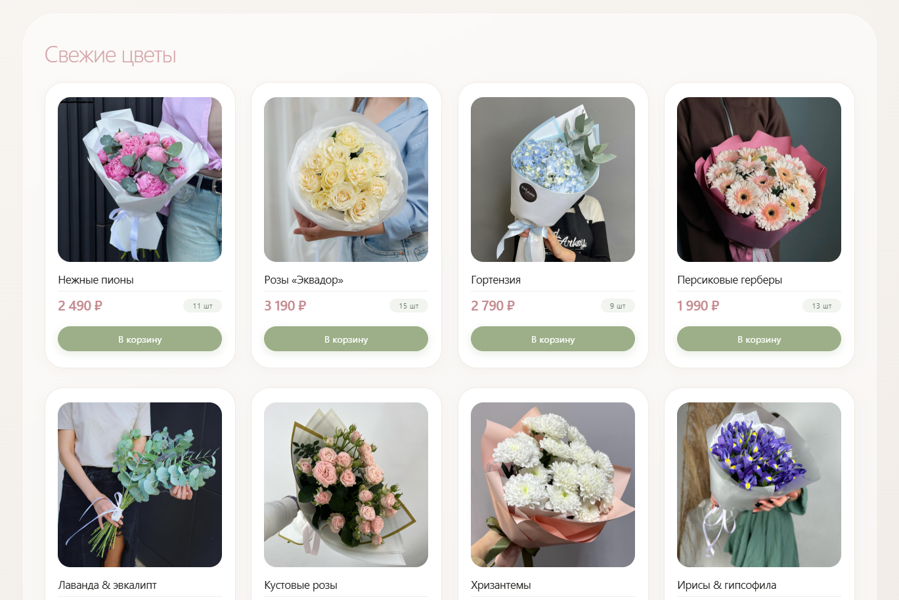

# ui-card

# 🌸 Каталог цветов — UI Card

Современный, адаптивный компонент карточки товара для интернет-магазина цветов. Дизайн выполнен в премиальном, минималистичном стиле с использованием стекломорфизма и плавных анимаций.

---

## 🎨 Особенности дизайна

- **Премиальная цветовая палитра**
  - Пыльно-розовый акцент (`#d4a0a5`) для заголовка
  - Нежный розовый (`#c48a8f`) для цен
  - Оливковый (`#9caf88`) для кнопок
  - Глубокий зелёный (`#2c4f3b`) для ховеров

- **Современные UI-решения**
  - Стекломорфизм (Glassmorphism) на фоне каталога
  - Плавные анимации появления карточек
  - Микро-взаимодействия (hover, scale, transform)
  - Мягкие тени и градиенты

- **Полная адаптивность**
  - Десктоп: 4 колонки
  - Планшет: 3 колонки
  - Мобильный: 2 колонки
  - Телефон: 1 колонка с увеличенным изображением

---

## 📱 Адаптивная сетка

| Устройство | Ширина экрана | Колонки |
| ---------- | ------------- | ------- |
| Десктоп    | > 1024px      | 4       |
| Планшет    | 720–1024px    | 3       |
| Мобильный  | 450–720px     | 2       |
| Телефон    | < 450px       | 1       |

---

## 🛠 Технологии

- **HTML5** — семантическая разметка
- **CSS3** — кастомные свойства, flexbox, grid, анимации
- **Inter** — современный шрифт от Google Fonts
- **Git** — контроль версий

---

## 📂 Структура проекта

ui-card/
├── index.html # Главная страница
├── card.css # Все стили
├── images/ # Изображения товаров
│ ├── card-01.jpg
│ ├── card-02.jpg
│ └── ...
└── README.md # Документация
